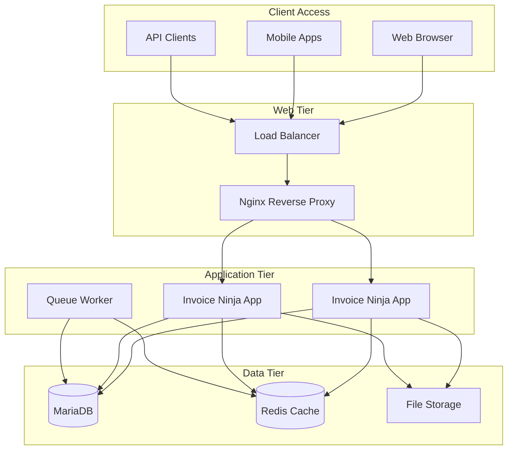

**Purpose:** Understand Invoice Ninja and how this repository packages it for containerized deployment.

**Contents**
- [What is Invoice Ninja](#what-is-invoice-ninja)
- [Repository Scope](#repository-scope)
- [Technology Stack](#technology-stack)
- [Key Features](#key-features)
- [Architecture](#architecture)
- [Sources](#sources)

## What is Invoice Ninja

Invoice Ninja is a self-hosted, open-source invoicing and billing application designed for freelancers, small businesses, and agencies. It provides a comprehensive solution for managing clients, creating professional invoices, tracking payments, and handling financial workflows.

**Core Capabilities:**
- **Professional Invoicing**: Create customizable invoices with multiple templates and branding options
- **Client Management**: Comprehensive client database with contact information and project tracking
- **Payment Processing**: Integration with 45+ payment gateways including PayPal, Stripe, and Square
- **Expense Tracking**: Monitor business expenses and attach receipts for better financial management
- **Time Tracking**: Built-in time tracking with project-based billing capabilities
- **Recurring Billing**: Automated subscription and recurring invoice generation
- **Multi-Company**: Support for multiple business entities within a single installation
- **Reporting**: Detailed financial reports, tax summaries, and business analytics

**Target Use Cases:**
- Freelancers needing professional invoice generation
- Small businesses requiring comprehensive billing solutions
- Agencies managing multiple clients and projects
- Organizations needing self-hosted financial management
- Businesses requiring payment gateway integrations

## Repository Scope

This repository provides a **containerized deployment solution** for Invoice Ninja, not the application source code itself. It packages the upstream Invoice Ninja application into a production-ready container environment.

**What This Repository Provides:**
- **Custom Container Images**: Optimized Docker images built from upstream Invoice Ninja source
- **Orchestration**: Docker Compose for development and Helm charts for production deployment
- **Configuration Management**: Environment-based configuration with secure secrets handling
- **Infrastructure Integration**: Database, cache, and web server configuration
- **Operational Tools**: Make-based automation for common deployment and management tasks
- **Security**: SOPS/age encryption for sensitive configuration data

**What This Repository Does NOT Provide:**
- Invoice Ninja application source code (use upstream repository for that)
- Payment gateway merchant accounts or API keys
- SSL certificates (provided via external certificate management)
- Backup and disaster recovery services (deployment-specific implementation required)

## Technology Stack

### Application Layer
- **Framework**: Laravel 10.x (PHP 8.1+)
- **Database**: MariaDB 10.6+ with UTF8MB4 support
- **Cache**: Redis 7.x for session storage, application cache, and queue management
- **Web Server**: Nginx 1.24+ with PHP-FPM integration
- **Queue System**: Redis-backed queue processing for background tasks

### Container Infrastructure  
- **Base Images**: Alpine Linux for minimal attack surface and smaller image sizes
- **Orchestration**: Docker Compose v2 for development, Kubernetes/Helm for production
- **Networking**: Custom bridge network with service discovery
- **Storage**: Named volumes for persistent data and application storage
- **Health Checks**: Application-aware health monitoring for all services

### Development & Operations
- **Build System**: Make-based automation with Docker multi-stage builds
- **Secrets Management**: SOPS with age encryption for secure configuration
- **Monitoring**: Structured logging with JSON output for centralized log aggregation
- **Testing**: Container-based testing with health check validation

## Key Features

### Business Functionality
| Feature | Description | Configuration |
|---------|-------------|---------------|
| Multi-Currency | Support for 90+ currencies with real-time exchange rates | `NINJA_MULTI_CURRENCY=true` |
| Multi-Language | Interface localization for 40+ languages | `APP_LOCALE=en` |
| Custom Fields | Extensible data model with custom client and invoice fields | Database configuration |
| Tax Management | Multiple tax rates, compound taxes, and tax-inclusive pricing | Tax settings in UI |
| Payment Terms | Configurable payment terms and late fee automation | `PAYMENT_TERMS_DAYS=30` |

### Technical Capabilities
| Feature | Description | Implementation |
|---------|-------------|----------------|
| API Access | RESTful API for integrations and automation | `/api/v1/*` endpoints |
| Webhooks | Event-driven notifications for external systems | Configurable webhook URLs |
| Import/Export | Data migration tools for QuickBooks, FreshBooks, etc. | Built-in migration commands |
| Custom Domains | White-label deployment with custom branding | DNS and SSL configuration |
| Mobile Apps | iOS and Android applications for field access | API-based mobile connectivity |

## Architecture

### Container Architecture

### Data Flow
1. **Web Requests**: Client requests routed through Nginx to PHP-FPM application
2. **Database Operations**: Laravel ORM handles all database interactions with MariaDB
3. **Caching**: Redis provides session storage, application cache, and queue management
4. **File Handling**: Local filesystem or cloud storage for invoice PDFs and attachments
5. **Background Processing**: Redis queue system for email sending and report generation

### Security Architecture
- **Network Isolation**: Container network with minimal exposed ports
- **Database Security**: Dedicated database user with limited privileges
- **Session Management**: Secure session handling with Redis backend
- **File Permissions**: Non-root container execution with proper file ownership
- **Secret Management**: External secret injection via environment variables

## Sources

- "Invoice Ninja Documentation" — https://invoiceninja.github.io/ — retrieved 2025-01-09
- "Invoice Ninja GitHub Repository" — https://github.com/invoiceninja/invoiceninja — retrieved 2025-01-09
- "Invoice Ninja Features Overview" — https://www.invoiceninja.com/features/ — retrieved 2025-01-09
- "Laravel Framework Documentation" — https://laravel.com/docs/10.x — retrieved 2025-01-09
- "Self-Hosting Guide" — https://invoiceninja.github.io/en/self-host-installation/ — retrieved 2025-01-09