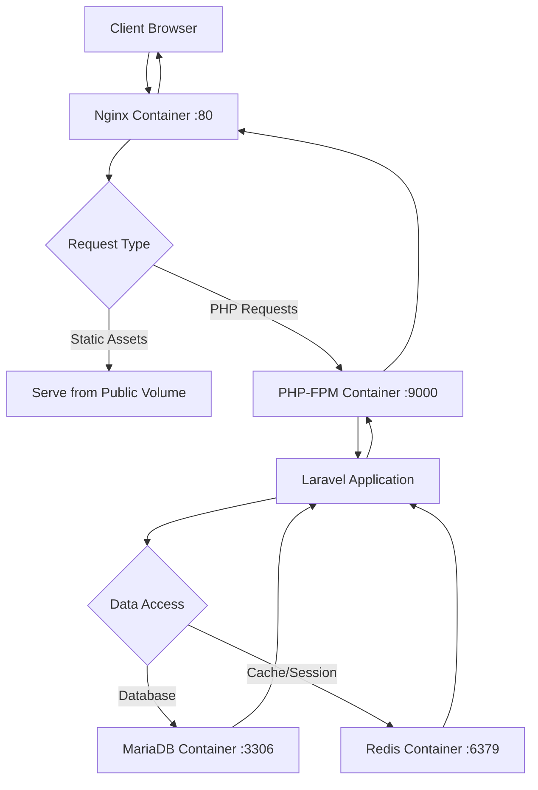
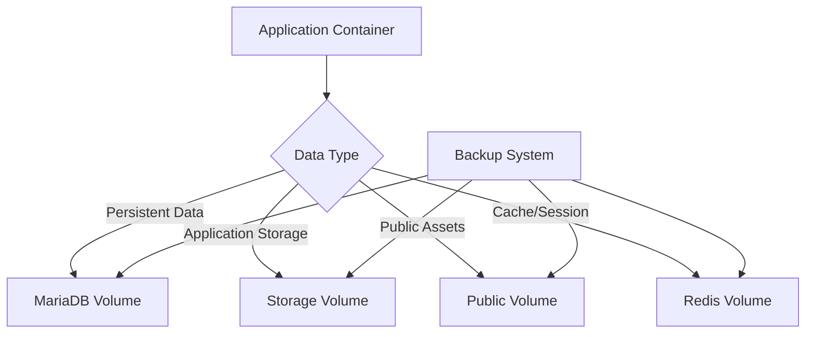

# Architecture

**Purpose**: This document describes the technical architecture and design decisions for the Firefly III application deployment, including component interactions, data flows, and infrastructure patterns.

## Table of Contents

- [System Overview](#system-overview)
- [Component Architecture](#component-architecture)
- [Data Flow](#data-flow)
- [Container Design](#container-design)
- [Network Architecture](#network-architecture)
- [Security Architecture](#security-architecture)
- [Scalability Considerations](#scalability-considerations)

## System Overview

This Firefly III deployment implements a microservices architecture using Docker containers, following the principle of separation of concerns and single responsibility for each service component.

### Architecture Principles

- **Container-First Design**: Each service runs in its own container with specific responsibilities
- **Stateless Application Layer**: The PHP application is stateless, with state managed by external services
- **Data Persistence**: Database and critical data stored in persistent volumes
- **Service Discovery**: Internal communication via Docker DNS and service names
- **Health Monitoring**: Each component includes health checks and monitoring capabilities

### Technology Stack

| Component | Technology | Version | Purpose |
|-----------|------------|---------|---------|
| Application | PHP + Laravel | 8.x + 11.x | Core Firefly III application |
| Web Server | Nginx | Alpine 3.22 | HTTP proxy and static asset serving |
| Database | MariaDB | 12.0.2 | Primary data storage |
| Cache/Sessions | Redis | Latest | Caching and session storage |
| Container Runtime | Docker | 20.10+ | Containerization platform |

## Component Architecture

### Application Container (`firefly-iii-application.application`)

**Responsibilities**:
- Firefly III PHP application execution
- Business logic processing
- API endpoint handling
- Background job processing

**Technical Details**:
- **Base Image**: Alpine Linux (minimal footprint)
- **Runtime**: PHP-FPM for request handling
- **Framework**: Laravel 11.x
- **Process Manager**: PHP-FPM master process
- **Port**: 9000 (FastCGI)

**Volume Mounts**:
- `/var/www/app/storage` - Application data, logs, cache
- `/var/www/app/public` - Public assets and uploads
- `/var/www/app/.env` - Environment configuration

### Nginx Container (`firefly-iii-application.nginx`)

**Responsibilities**:
- HTTP request routing
- Static asset serving
- SSL/TLS termination (when configured)
- Request proxying to PHP-FPM

**Technical Details**:
- **Base Image**: nginx:alpine3.22
- **Configuration**: Custom nginx.conf optimized for Laravel
- **Port**: 80 (HTTP)
- **Health Check**: `/health` endpoint

**Key Features**:
- FastCGI proxy to application container
- Static asset caching (1 month expiry)
- Security headers
- Client request size limits (20MB)

### MariaDB Container (`firefly-iii-application.mariadb`)

**Responsibilities**:
- Primary data persistence
- Transaction management
- Data consistency and integrity
- Backup and recovery support

**Technical Details**:
- **Base Image**: mariadb:12.0.2-noble
- **Character Set**: UTF8MB4 (full Unicode support)
- **Collation**: utf8mb4_unicode_ci
- **Port**: 3306
- **Health Check**: Database connection test

**Configuration**:
- Optimized for Firefly III workloads
- Transaction log configuration
- Connection pooling support
- Timezone handling disabled for consistency

### Redis Container (`firefly-iii-application.redis`)

**Responsibilities**:
- Session storage
- Application caching
- Queue management
- Temporary data storage

**Technical Details**:
- **Base Image**: redis:latest
- **Persistence**: RDB snapshots enabled
- **Port**: 6379
- **Health Check**: Redis PING command

**Usage Patterns**:
- Session data with configurable TTL
- Application cache for computed values
- Queue storage for background jobs
- Temporary file storage

## Data Flow

### Request Processing Flow

### Data Persistence Flow

### Inter-Service Communication

- **Nginx ↔ Application**: FastCGI protocol over TCP
- **Application ↔ MariaDB**: MySQL protocol over TCP
- **Application ↔ Redis**: Redis protocol over TCP
- **Service Discovery**: Docker internal DNS resolution

## Container Design

### Image Build Strategy

**Multi-Stage Builds**: Each service uses optimized multi-stage builds to minimize image size and attack surface.

**Base Image Selection**:
- Alpine Linux for minimal footprint and security
- Official upstream images for reliability
- LTS versions for stability

**Security Hardening**:
- Non-root user execution
- Minimal package installation
- Regular base image updates
- Vulnerability scanning integration

### Resource Management

**CPU Allocation**:
- Application: 0.5-2.0 cores (burstable)
- Nginx: 0.1-0.5 cores
- MariaDB: 0.5-4.0 cores (database intensive)
- Redis: 0.1-0.5 cores

**Memory Allocation**:
- Application: 512MB-2GB (Laravel memory usage)
- Nginx: 64MB-256MB
- MariaDB: 1GB-8GB (depending on data size)
- Redis: 256MB-1GB (cache size dependent)

## Network Architecture

### Docker Networking

**Network Type**: External bridge network (`webgrip`)

**Benefits**:
- Service isolation from host
- Internal DNS resolution
- Controlled external access
- Multi-project network sharing

### Port Mapping

| Service | Internal Port | External Port | Purpose |
|---------|---------------|---------------|---------|
| Nginx | 80 | 8080 | HTTP access |
| Application | 9000 | Not exposed | FastCGI (internal) |
| MariaDB | 3306 | 3306 | Database access (dev only) |
| Redis | 6379 | Not exposed | Cache access (internal) |

### Service Discovery

Services communicate using Docker's built-in DNS:
- `firefly-iii-application.application` → Application container
- `firefly-iii-application.mariadb` → Database container
- `firefly-iii-application.redis` → Redis container
- `firefly-iii-application.nginx` → Nginx container

## Security Architecture

### Container Security

**Principle of Least Privilege**:
- Non-root user execution
- Minimal file system permissions
- Read-only root filesystems where possible
- Specific capability dropping

**Network Security**:
- Internal-only communication for sensitive services
- Firewall rules via Docker networks
- No unnecessary port exposure
- TLS encryption for external communication

### Data Security

**Encryption at Rest**:
- Database volume encryption (optional)
- Application secret encryption
- File system encryption support

**Encryption in Transit**:
- HTTPS for external access (production)
- Internal communication over encrypted Docker networks
- Database connection encryption (configurable)

### Access Control

**Authentication Layers**:
1. Network-level access control
2. Application-level authentication
3. Database user authentication
4. API token validation

## Scalability Considerations

### Horizontal Scaling

**Stateless Design**: The application layer is stateless, enabling horizontal scaling:
- Multiple application container instances
- Load balancing via external load balancer
- Session sharing via Redis

**Database Scaling**:
- Read replicas for read-heavy workloads
- Connection pooling for efficiency
- Sharding considerations for large datasets

### Vertical Scaling

**Resource Optimization**:
- CPU and memory limits per container
- Resource monitoring and alerting
- Auto-scaling based on metrics

### Performance Optimization

**Caching Strategy**:
- Application-level caching via Redis
- Static asset caching via Nginx
- Database query optimization
- CDN integration for static assets

**Database Optimization**:
- Index optimization for Firefly III queries
- Connection pooling
- Query performance monitoring
- Regular maintenance tasks

## Compliance with Upstream

**Verification Statement**: This architecture follows Firefly III's recommended deployment patterns and Docker best practices as documented in the official installation guides. The service separation and communication patterns align with Laravel application architecture principles.

**Deviations**: None identified. The architecture implements standard patterns recommended by both Firefly III and Laravel documentation.

---

**Sources**:
- Firefly III Docker Installation Guide - https://docs.firefly-iii.org/how-to/firefly-iii/installation/docker/ (Retrieved: 2024-01-15)
- Laravel Architecture Concepts - https://laravel.com/docs/11.x/lifecycle (Retrieved: 2024-01-15)
- Docker Best Practices - https://docs.docker.com/develop/dev-best-practices/ (Retrieved: 2024-01-15)
- Nginx Configuration Best Practices - https://nginx.org/en/docs/ (Retrieved: 2024-01-15)