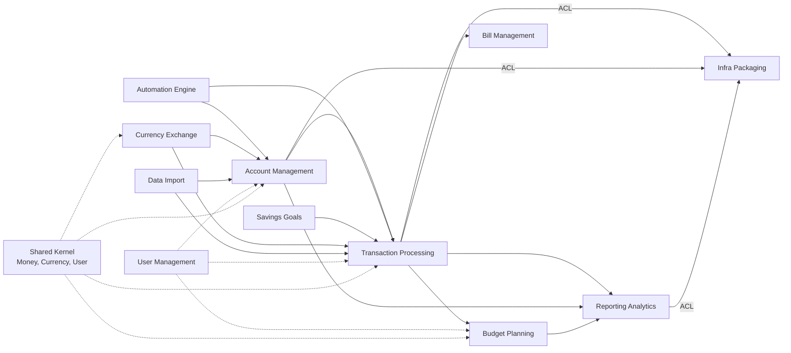

**Purpose:** Visualize dependencies and translation boundaries.

**Contents**
- [Map](#map)
- [Notes](#notes)
- [Sources](#sources)

### Map

### Notes

**Upstream Integration Points:**
- **Transaction Processing ↔ Account Management**: Strong consistency required for balance updates
- **Budget Planning ↔ Transaction Processing**: Event-driven updates when transactions affect budgets
- **Automation Engine → Multiple Contexts**: Rules can modify transactions, accounts, and budgets
- **Currency Exchange → Financial Contexts**: Exchange rates affect all monetary calculations

**Anti-Corruption Layers (ACL):**
- **Laravel ORM ACL**: Translates domain objects to/from Eloquent models
- **REST API ACL**: Converts domain models to JSON representations for external consumers
- **Database Schema ACL**: Maps domain concepts to relational database tables
- **Container Packaging ACL**: Adapts Firefly III domain to our infrastructure patterns

**Shared Kernel Components:**
- **Money Value Object**: Immutable monetary amounts with currency awareness
- **User Context**: Authentication, authorization, and tenant isolation
- **Date/Time Handling**: Consistent temporal operations across all contexts
- **Audit Logging**: Cross-cutting concern for compliance and troubleshooting

**Context Relationship Patterns:**
- **Customer/Supplier**: Transaction Processing (customer) ← Budget Planning (supplier)
- **Conformist**: Reporting Analytics conforms to data models from other contexts
- **Partnership**: Account Management ↔ Transaction Processing (strong bidirectional dependency)
- **Separate Ways**: User Management operates independently with minimal coupling

**Integration Events:**
- `TransactionRecorded` → Updates account balances and budget calculations
- `AccountBalanceChanged` → Triggers reporting cache invalidation
- `BudgetExceeded` → Fires notification events
- `RuleExecuted` → Audits automation actions across contexts

**Translation Responsibilities:**
- **Financial Precision**: Ensure monetary calculations maintain precision across context boundaries
- **Currency Conversion**: Handle multi-currency scenarios with proper exchange rate application
- **Temporal Consistency**: Maintain consistent date/time handling for financial reporting
- **User Isolation**: Enforce tenant boundaries when data crosses context boundaries

### Sources
- "Firefly III Architecture Overview" — https://docs.firefly-iii.org/explanation/more-information/architecture — retrieved 2025-01-09
- "Domain-Driven Design Context Mapping" — https://www.domainlanguage.com/ddd/reference/ — retrieved 2025-01-09
- "Laravel Service Architecture" — https://laravel.com/docs/10.x/providers — retrieved 2025-01-09

<!-- ai-docs-metadata
{"last_audit":"2025-01-09","fingerprints":{"sources":{"https://docs.firefly-iii.org/explanation/more-information/architecture":"sha256:pending","https://www.domainlanguage.com/ddd/reference/":"sha256:pending","https://laravel.com/docs/10.x/providers":"sha256:pending"},"sections":{"context-map":"sha256:pending"}}}
-->