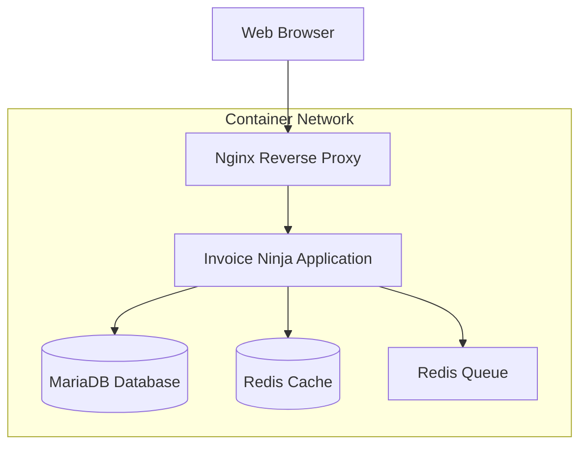

# Invoice Ninja Application Documentation

Welcome to the comprehensive documentation for our containerized Invoice Ninja deployment. This documentation provides everything you need to deploy, configure, and operate Invoice Ninja in a containerized environment.

## Quick Start

Get Invoice Ninja running locally in minutes:

```bash
git clone <repository-url>
cd firefly-iii-application
cp .env.example .env
make start
```

Access the application at `http://localhost:8080`

## What's Included

This repository provides a complete, production-ready deployment of **Invoice Ninja** with:

- **Invoice Ninja Application**: Self-hosted invoicing and billing platform
- **Database**: MariaDB with optimized configuration
- **Cache & Sessions**: Redis for performance and session management  
- **Web Server**: Nginx reverse proxy with SSL termination capability
- **Container Orchestration**: Docker Compose for development, Helm charts for production
- **Security**: Integrated secrets management with SOPS/age encryption

## Documentation Sections

### 🚀 [Application](app/overview.md)
Learn about Invoice Ninja features, lifecycle, and configuration options.

### 🔗 [Integrations](integrations/database.md) 
Configure database, cache, and email integrations.

### ⚙️ [Operations](ops/runbook.md)
Day-to-day operational procedures, monitoring, and troubleshooting.

## Architecture Overview



## Key Features

- **📧 Invoicing & Billing**: Create professional invoices, estimates, and recurring billing
- **💳 Payment Processing**: Integration with multiple payment gateways
- **📊 Reporting**: Comprehensive financial reports and analytics
- **🌐 Multi-tenant**: Support for multiple companies and users
- **🔌 API Access**: RESTful API for integrations and automation
- **📱 Mobile Ready**: Responsive design for mobile and tablet access

## Support

- **Quick Help**: See our [Troubleshooting Guides](ops/troubleshooting/startup.md)
- **Operations**: Refer to the [Runbook](ops/runbook.md) for common procedures  
- **Issues**: Report problems via GitHub Issues
- **Updates**: Check [Lifecycle & Support](app/lifecycle.md) for upgrade procedures

---

**Next Steps**: Start with the [Application Overview](app/overview.md) or jump directly to the [Quick Start Guide](../README.md).
