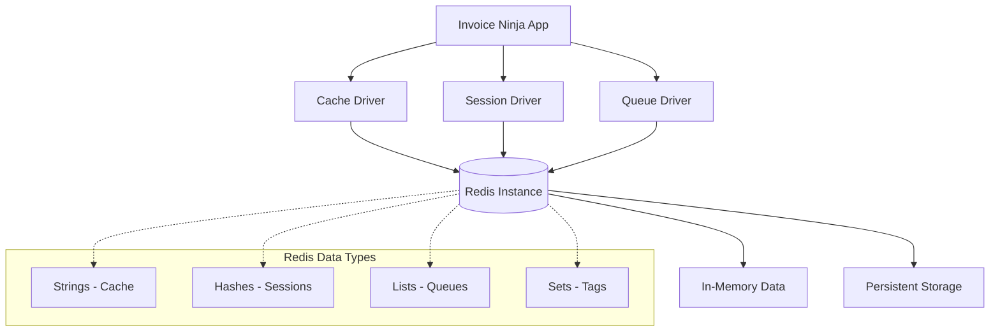
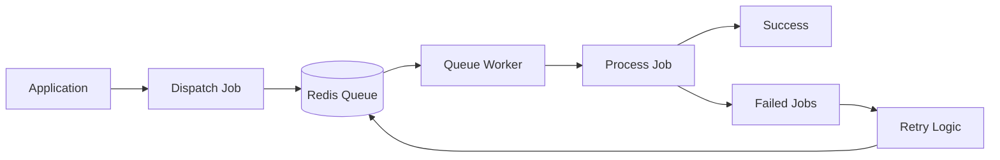

**Purpose:** Configure and optimize Redis integration for Invoice Ninja caching, session storage, and queue management.

**Contents**
- [Redis Overview](#redis-overview)
- [Connection Configuration](#connection-configuration)
- [Cache Management](#cache-management)
- [Session Storage](#session-storage)
- [Queue Processing](#queue-processing)
- [Performance Optimization](#performance-optimization)
- [Monitoring and Troubleshooting](#monitoring-and-troubleshooting)
- [Sources](#sources)

## Redis Overview

### Redis as Multi-Purpose Data Store
Invoice Ninja uses Redis for three primary functions:

- **Application Cache**: Frequently accessed data like user preferences, company settings, and lookup tables
- **Session Storage**: User session data for web application state management
- **Queue Backend**: Background job processing for emails, reports, and data imports

### Redis Architecture


### Deployment Configuration
| Environment | Redis Setup | Persistence | Notes |
|-------------|-------------|-------------|-------|
| **Development** | Single instance | Disabled | Fast iteration, data loss acceptable |
| **Staging** | Single instance | RDB snapshots | Testing with persistence |
| **Production** | Single instance with persistence | RDB + AOF | High availability setup |

## Connection Configuration

### Environment Variables
Redis connection is configured through these environment variables:

| Variable | Development | Production | Purpose |
|----------|-------------|------------|---------|
| `REDIS_HOST` | `firefly-iii-application.redis` | `production-redis.example.com` | Redis server hostname |
| `REDIS_PORT` | `6379` | `6379` | Redis server port |
| `REDIS_PASSWORD` | `""` (no auth) | `secure_redis_password` | Redis authentication |
| `REDIS_CLIENT` | `phpredis` | `phpredis` | PHP Redis client library |
| `REDIS_PREFIX` | `firefly-iii-application_` | `ninja_prod_` | Key namespace prefix |

### Laravel Cache Configuration
Laravel cache configuration for Redis:

```php
// config/cache.php
'redis' => [
    'driver' => 'redis',
    'connection' => 'cache',
    'lock_connection' => 'default',
],

// config/database.php - Redis connections
'redis' => [
    'client' => env('REDIS_CLIENT', 'phpredis'),
    
    'options' => [
        'cluster' => env('REDIS_CLUSTER', 'redis'),
        'prefix' => env('REDIS_PREFIX', Str::slug(env('APP_NAME', 'laravel'), '_').'_database_'),
    ],
    
    'default' => [
        'url' => env('REDIS_URL'),
        'host' => env('REDIS_HOST', '127.0.0.1'),
        'password' => env('REDIS_PASSWORD'),
        'port' => env('REDIS_PORT', '6379'),
        'database' => env('REDIS_DB', '0'),
        'read_timeout' => 60,
        'context' => [],
    ],
    
    'cache' => [
        'url' => env('REDIS_URL'),
        'host' => env('REDIS_HOST', '127.0.0.1'),
        'password' => env('REDIS_PASSWORD'),
        'port' => env('REDIS_PORT', '6379'),
        'database' => env('REDIS_CACHE_DB', '1'),
        'read_timeout' => 60,
        'context' => [],
    ],
]
```

### Connection Security
- **Authentication**: Password-based authentication for production
- **Network Isolation**: Redis accessible only from application containers
- **TLS Encryption**: Optional TLS for sensitive environments
- **Command Restriction**: Dangerous commands disabled (FLUSHALL, CONFIG, KEYS)

### Connection Health Checks
Application health checks include Redis connectivity:

```bash
# Redis connectivity check
redis-cli -h $REDIS_HOST -p $REDIS_PORT ping

# Health check in container readiness probe
nc -z firefly-iii-application-redis-master 6379

# Laravel Redis connectivity
php artisan tinker --execute="Redis::ping();"
```

## Cache Management

### Cache Strategies
Invoice Ninja implements multiple caching strategies:

| Cache Type | TTL | Use Case | Redis Data Type |
|------------|-----|----------|------------------|
| **Database Queries** | 1 hour | Frequent lookups | String with serialized data |
| **User Preferences** | 24 hours | User settings and preferences | Hash |
| **Company Settings** | 12 hours | Company configuration | Hash |
| **Currency Rates** | 6 hours | Exchange rate data | String with JSON |
| **Tax Calculations** | 1 hour | Complex tax computations | String with serialized data |

### Cache Operations
```php
// Cache usage examples in Invoice Ninja
use Illuminate\Support\Facades\Cache;

// Store user preferences
Cache::put('user_preferences_' . $userId, $preferences, 86400); // 24 hours

// Retrieve cached data with fallback
$exchangeRates = Cache::remember('exchange_rates', 21600, function () {
    return ExchangeRateService::fetchRates();
});

// Cache invalidation
Cache::forget('company_settings_' . $companyId);
Cache::tags(['invoices', 'company_' . $companyId])->flush();

// Distributed cache locking
Cache::lock('invoice_generation_' . $invoiceId, 30)->get(function () {
    // Generate invoice PDF
});
```

### Cache Key Patterns
Standardized cache key naming conventions:

```bash
# User-specific caches
user_preferences_{user_id}
user_permissions_{user_id}

# Company-specific caches  
company_settings_{company_id}
company_users_{company_id}

# Global application caches
exchange_rates
tax_rates_{country_code}
payment_gateways

# Temporary caches
pdf_generation_{invoice_id}
import_progress_{import_id}
```

### Cache Tags and Invalidation
Laravel cache tags for efficient invalidation:

```php
// Tag-based caching
Cache::tags(['invoices', 'company_' . $companyId])->put($key, $value, $ttl);

// Invalidate all invoice-related caches for a company
Cache::tags(['company_' . $companyId])->flush();

// Selective invalidation
Cache::tags(['invoices'])->flush(); // All invoice caches
Cache::tags(['users'])->flush();    // All user caches
```

## Session Storage

### Session Configuration
Laravel session configuration for Redis backend:

```php
// config/session.php
'driver' => env('SESSION_DRIVER', 'redis'),
'connection' => 'default',
'table' => 'sessions',
'store' => null,
'lottery' => [2, 100],
'cookie' => env('SESSION_COOKIE', Str::slug(env('APP_NAME', 'laravel'), '_').'_session'),
'path' => '/',
'domain' => env('SESSION_DOMAIN'),
'secure' => env('SESSION_SECURE', false),
'http_only' => true,
'same_site' => 'lax',
'encrypt' => env('SESSION_ENCRYPT', false),
```

### Session Data Structure
Sessions are stored as Redis hashes with metadata:

```bash
# Session key format
session:{session_id}

# Session data structure
HGETALL session:abc123def456
"data" -> "serialized_session_data"
"last_activity" -> "1704823200"
"user_id" -> "123"
"ip_address" -> "192.168.1.100"
"user_agent" -> "Mozilla/5.0..."
```

### Session Management
```bash
# View active sessions
redis-cli KEYS "session:*" | wc -l

# Session cleanup (handled automatically by Laravel)
redis-cli EVAL "
  local keys = redis.call('KEYS', 'session:*')
  local expired = 0
  for i=1,#keys do
    local ttl = redis.call('TTL', keys[i])
    if ttl == -1 then
      redis.call('DEL', keys[i])
      expired = expired + 1
    end
  end
  return expired
" 0

# Force session cleanup for specific user
php artisan session:gc
```

### Session Security
- **HttpOnly Cookies**: Prevent JavaScript access to session cookies
- **Secure Cookies**: HTTPS-only transmission in production
- **SameSite Protection**: CSRF protection through cookie attributes
- **Session Encryption**: Optional encryption of session data
- **Session Regeneration**: Automatic regeneration on authentication changes

## Queue Processing

### Queue Configuration
Laravel queue configuration for Redis backend:

```php
// config/queue.php
'redis' => [
    'driver' => 'redis',
    'connection' => 'default',
    'queue' => env('REDIS_QUEUE', 'default'),
    'retry_after' => 90,
    'block_for' => null,
    'after_commit' => false,
]
```

### Queue Architecture


### Job Types
Invoice Ninja processes these background jobs:

| Job Type | Queue | Priority | Typical Duration |
|----------|-------|----------|------------------|
| **Email Sending** | `emails` | High | 2-5 seconds |
| **PDF Generation** | `default` | Medium | 5-15 seconds |
| **Data Import** | `imports` | Low | 30-300 seconds |
| **Report Generation** | `reports` | Low | 10-60 seconds |
| **Webhook Delivery** | `webhooks` | Medium | 1-10 seconds |

### Queue Operations
```bash
# Start queue worker
php artisan queue:work redis --queue=emails,default,imports

# Process single job
php artisan queue:work redis --once

# View queue status
php artisan queue:stats

# Failed job management
php artisan queue:failed           # List failed jobs
php artisan queue:retry all        # Retry all failed jobs
php artisan queue:retry 1          # Retry specific job
php artisan queue:flush            # Clear failed jobs

# Queue monitoring
redis-cli LLEN queues:default      # Check queue length
redis-cli LLEN queues:failed       # Check failed queue length
```

### Job Monitoring
Monitor queue health and performance:

```bash
# Queue lengths by type
for queue in default emails imports reports webhooks; do
  echo "$queue: $(redis-cli LLEN queues:$queue)"
done

# Failed job analysis
redis-cli LRANGE queues:failed 0 -1 | jq '.exception'

# Worker process monitoring
ps aux | grep "queue:work"
```

## Performance Optimization

### Redis Configuration
Optimized Redis configuration for Invoice Ninja:

```ini
# redis.conf optimizations
maxmemory 512mb                    # Set memory limit
maxmemory-policy allkeys-lru       # Eviction policy
timeout 300                        # Client idle timeout
tcp-keepalive 60                   # Keep connections alive

# Persistence settings
save 900 1                         # Snapshot after 900s if 1+ changes
save 300 10                        # Snapshot after 300s if 10+ changes  
save 60 10000                      # Snapshot after 60s if 10000+ changes

# AOF settings for durability
appendonly yes                     # Enable AOF
appendfsync everysec              # Sync every second
auto-aof-rewrite-percentage 100   # Rewrite when 100% larger
auto-aof-rewrite-min-size 64mb    # Minimum size for rewrite

# Network optimization
tcp-backlog 511                    # Connection backlog
timeout 0                          # No client timeout
tcp-keepalive 300                  # Keep-alive interval
```

### Memory Management
Redis memory optimization strategies:

```bash
# Monitor memory usage
redis-cli INFO memory | grep used_memory_human
redis-cli INFO memory | grep used_memory_peak_human

# Key expiration patterns
redis-cli --scan --pattern "session:*" | xargs redis-cli TTL

# Memory optimization commands
redis-cli MEMORY USAGE session:abc123    # Memory usage per key
redis-cli MEMORY STATS                   # Memory statistics
redis-cli SLOWLOG GET 10                 # Slow operations
```

### Connection Pool Optimization
PHP Redis connection pooling:

```php
// Optimize phpredis configuration
ini_set('redis.session.locking_enabled', 1);
ini_set('redis.session.lock_expire', 30);
ini_set('redis.session.lock_wait_time', 50000);

// Connection pool settings
$redis = new Redis();
$redis->pconnect($host, $port, 2.5, 'persistent_connection');
$redis->setOption(Redis::OPT_TCP_KEEPALIVE, 1);
$redis->setOption(Redis::OPT_READ_TIMEOUT, 60);
```

## Monitoring and Troubleshooting

### Redis Health Monitoring
Key metrics to monitor for Redis performance:

| Metric | Target | Alert Threshold | Purpose |
|--------|--------|-----------------|---------|
| **Memory Usage** | < 80% of maxmemory | > 90% | Prevent OOM errors |
| **Connected Clients** | < 90% of maxclients | > 95% | Connection management |
| **Keyspace Hit Ratio** | > 90% | < 80% | Cache efficiency |
| **Commands/Second** | Baseline dependent | 2x baseline | Performance monitoring |
| **Slow Log Entries** | < 10/hour | > 50/hour | Query performance |

### Monitoring Commands
```bash
# Redis performance monitoring
redis-cli INFO stats | grep instantaneous_ops_per_sec
redis-cli INFO stats | grep keyspace_hits
redis-cli INFO stats | grep keyspace_misses

# Connection monitoring
redis-cli INFO clients | grep connected_clients
redis-cli CLIENT LIST

# Memory monitoring
redis-cli INFO memory | grep used_memory
redis-cli INFO memory | grep mem_fragmentation_ratio

# Slow query monitoring
redis-cli SLOWLOG GET 10
redis-cli CONFIG GET slowlog-log-slower-than
```

### Common Issues and Solutions

| Problem | Symptom | Solution |
|---------|---------|----------|
| **High Memory Usage** | Memory alerts, evictions | Implement key expiration, optimize data structures |
| **Connection Limits** | Connection refused errors | Increase maxclients, implement connection pooling |
| **Slow Operations** | Application timeouts | Analyze slow log, optimize key patterns |
| **Cache Misses** | Poor performance | Review cache strategy, increase TTL for stable data |
| **Queue Backlog** | Jobs not processing | Scale queue workers, optimize job processing |

### Diagnostic Commands
```bash
# Check Redis connectivity
redis-cli -h $REDIS_HOST -p $REDIS_PORT ping

# Application cache test
make run CMD="php artisan tinker --execute='Cache::put(\"test\", \"value\", 60); echo Cache::get(\"test\");'"

# Queue connectivity test
make run CMD="php artisan queue:work redis --once --timeout=10"

# Session test
make run CMD="php artisan tinker --execute='session()->put(\"test\", \"value\"); echo session(\"test\");'"

# Performance analysis
redis-cli --latency -h $REDIS_HOST -p $REDIS_PORT
redis-cli --stat -h $REDIS_HOST -p $REDIS_PORT
```

## Container Interface

| Aspect | Value / Path | Notes |
|-------|---------------|-------|
| Redis Version | 8.2.1 (Bitnami) | Stable release with security updates |
| Port | 6379 | Standard Redis port |
| Persistence | RDB snapshots | Point-in-time recovery |
| Memory Limit | 256MB (configurable) | Based on workload requirements |
| Authentication | Password-based | Production security requirement |
| Commands | Restricted dangerous commands | FLUSHALL, CONFIG, KEYS disabled |

## Sources

- "Redis Documentation" — https://redis.io/docs/ — retrieved 2025-01-09
- "Laravel Cache Documentation" — https://laravel.com/docs/10.x/cache — retrieved 2025-01-09
- "Laravel Queue Documentation" — https://laravel.com/docs/10.x/queues — retrieved 2025-01-09
- "PHP Redis Extension" — https://github.com/phpredis/phpredis — retrieved 2025-01-09
- "Redis Performance Optimization" — https://redis.io/docs/management/optimization/ — retrieved 2025-01-09