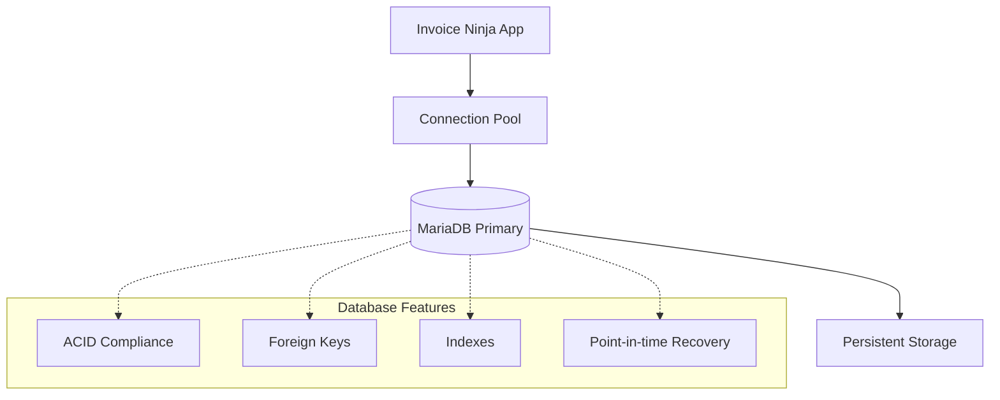

**Purpose:** Configure and optimize MariaDB database integration for Invoice Ninja deployment.

**Contents**
- [Database Overview](#database-overview)
- [Connection Configuration](#connection-configuration)
- [Schema and Migrations](#schema-and-migrations)
- [Performance Optimization](#performance-optimization)
- [Backup and Recovery](#backup-and-recovery)
- [Monitoring and Maintenance](#monitoring-and-maintenance)
- [Sources](#sources)

## Database Overview

### MariaDB as MySQL Compatible Database
Invoice Ninja uses MariaDB as its primary database engine, providing MySQL compatibility with enhanced performance and features:

- **Version**: MariaDB 12.0.2 (latest stable)
- **Character Set**: UTF8MB4 for full Unicode support including emojis
- **Collation**: utf8mb4_unicode_ci for proper sorting and comparison
- **Engine**: InnoDB for ACID compliance and foreign key support
- **Isolation Level**: READ COMMITTED for balanced consistency and performance

### Database Architecture


### Supported Database Operations
| Operation | Implementation | Performance Notes |
|-----------|----------------|-------------------|
| **Transactions** | InnoDB with ACID compliance | Automatic rollback on failures |
| **Foreign Keys** | Enforced referential integrity | Prevents orphaned records |
| **Indexing** | B-tree indexes on key columns | Optimized for Invoice Ninja queries |
| **Full-text Search** | MySQL full-text indexes | Invoice and client search functionality |
| **JSON Data** | Native JSON column type | Custom fields and metadata storage |

## Connection Configuration

### Environment Variables
Database connection is configured through environment variables:

| Variable | Development | Production | Purpose |
|----------|-------------|------------|---------|
| `DB_CONNECTION` | `mysql` | `mysql` | Database driver (MySQL compatible) |
| `DB_HOST` | `firefly-iii-application.mariadb` | `production-mariadb.example.com` | Database server hostname |
| `DB_PORT` | `3306` | `3306` | Database server port |
| `DB_DATABASE` | `application` | `invoiceninja_prod` | Database name |
| `DB_USERNAME` | `application` | `ninja_app` | Database user |
| `DB_PASSWORD` | `application` | `secure_random_password` | Database password |

### Connection Pool Settings
Laravel manages database connections with configurable pooling:

```php
// Database configuration (config/database.php)
'mysql' => [
    'driver' => 'mysql',
    'host' => env('DB_HOST', '127.0.0.1'),
    'port' => env('DB_PORT', '3306'),
    'database' => env('DB_DATABASE', 'forge'),
    'username' => env('DB_USERNAME', 'forge'),
    'password' => env('DB_PASSWORD', ''),
    'charset' => 'utf8mb4',
    'collation' => 'utf8mb4_unicode_ci',
    'prefix' => '',
    'prefix_indexes' => true,
    'strict' => env('DB_STRICT', true),
    'engine' => 'InnoDB',
    'options' => [
        PDO::ATTR_PERSISTENT => true,
        PDO::ATTR_TIMEOUT => 60,
        PDO::MYSQL_ATTR_USE_BUFFERED_QUERY => true,
    ],
]
```

### Connection Security
- **SSL/TLS**: Encrypted connections for production deployments
- **Authentication**: Dedicated application user with limited privileges
- **Network Isolation**: Database accessible only from application containers
- **Password Management**: Secure secret management via Kubernetes secrets

### Connection Health Checks
Application health checks include database connectivity:

```bash
# Database connectivity check
php artisan tinker --execute="DB::connection()->getPdo();"

# Health check in container readiness probe
nc -z firefly-iii-application-mariadb 3306
```

## Schema and Migrations

### Database Schema Overview
Invoice Ninja uses a comprehensive database schema with these core tables:

| Table Group | Key Tables | Purpose |
|-------------|------------|---------|
| **Core Entities** | `companies`, `accounts`, `users` | Multi-tenant architecture |
| **Client Management** | `clients`, `contacts`, `client_contacts` | Customer information |
| **Invoicing** | `invoices`, `invoice_items`, `recurring_invoices` | Billing and invoicing |
| **Payments** | `payments`, `payment_types`, `client_gateway_tokens` | Payment processing |
| **Products** | `products`, `tax_rates`, `currencies` | Catalog and pricing |
| **System** | `migrations`, `jobs`, `failed_jobs` | Framework tables |

### Migration Management
Database schema is managed through Laravel migrations:

```bash
# Run all pending migrations
php artisan migrate

# Check migration status
php artisan migrate:status

# Rollback last migration batch
php artisan migrate:rollback

# Fresh migration (development only)
php artisan migrate:fresh --seed
```

### Key Indexes
Critical indexes for Invoice Ninja performance:

```sql
-- Invoice lookup indexes
CREATE INDEX idx_invoices_client_id ON invoices(client_id);
CREATE INDEX idx_invoices_status ON invoices(status_id);
CREATE INDEX idx_invoices_date ON invoices(date);
CREATE INDEX idx_invoices_number ON invoices(number);

-- Payment indexes
CREATE INDEX idx_payments_client_id ON payments(client_id);
CREATE INDEX idx_payments_invoice_id ON payments(invoice_id);
CREATE INDEX idx_payments_date ON payments(date);

-- Full-text search indexes
CREATE FULLTEXT INDEX ft_clients_name ON clients(name);
CREATE FULLTEXT INDEX ft_invoices_notes ON invoices(private_notes, public_notes);
```

### Data Types and Constraints
Important data type choices:

| Column Type | Usage | Example |
|-------------|-------|---------|
| `DECIMAL(20,6)` | Monetary amounts | Invoice totals, payment amounts |
| `JSON` | Custom fields and metadata | Client custom fields, invoice data |
| `TIMESTAMP` | Date/time with timezone | Created/updated timestamps |
| `VARCHAR(191)` | Text fields with index limits | Names, emails (UTF8MB4 safe) |
| `TEXT` | Large text content | Invoice notes, terms |

## Performance Optimization

### Query Optimization
Invoice Ninja includes query optimizations:

```sql
-- Optimized invoice listing query
SELECT i.id, i.number, i.date, i.amount, i.balance,
       c.name as client_name, c.id as client_id
FROM invoices i
JOIN clients c ON i.client_id = c.id
WHERE i.company_id = ? 
  AND i.is_deleted = 0
  AND c.is_deleted = 0
ORDER BY i.date DESC
LIMIT 50;

-- Payment summary query with aggregation
SELECT 
    DATE_FORMAT(date, '%Y-%m') as month,
    SUM(amount) as total_payments,
    COUNT(*) as payment_count
FROM payments 
WHERE company_id = ? 
  AND is_deleted = 0
  AND date >= DATE_SUB(NOW(), INTERVAL 12 MONTH)
GROUP BY DATE_FORMAT(date, '%Y-%m')
ORDER BY month DESC;
```

### Database Configuration
MariaDB optimizations for Invoice Ninja:

```ini
# MariaDB configuration optimizations
[mysqld]
# InnoDB settings
innodb_buffer_pool_size = 256M      # 70% of available RAM
innodb_log_file_size = 64M          # Transaction log size
innodb_flush_log_at_trx_commit = 1  # ACID compliance
innodb_file_per_table = 1           # Separate files per table

# Connection settings
max_connections = 100               # Concurrent connections
wait_timeout = 600                  # Connection timeout
interactive_timeout = 600          # Interactive timeout

# Query cache (if enabled)
query_cache_type = 1                # Enable query cache
query_cache_size = 32M              # Cache size
query_cache_limit = 2M              # Max cached query size

# Character set
character_set_server = utf8mb4      # Full Unicode support
collation_server = utf8mb4_unicode_ci

# Logging
slow_query_log = 1                  # Enable slow query log
long_query_time = 2                 # Log queries > 2 seconds
```

### Connection Pool Optimization
PHP-FPM and Laravel connection pooling:

```ini
# PHP-FPM pool configuration
pm = dynamic
pm.max_children = 50
pm.start_servers = 5
pm.min_spare_servers = 5
pm.max_spare_servers = 35
pm.max_requests = 500

# Laravel database configuration
DB_CONNECTION_TIMEOUT=60
DB_RETRY_ATTEMPTS=3
DB_RETRY_DELAY=1000
```

## Backup and Recovery

### Backup Strategy
Comprehensive backup approach for Invoice Ninja data:

```bash
# Full database backup
mysqldump \
  --host=$DB_HOST \
  --user=$DB_USERNAME \
  --password=$DB_PASSWORD \
  --single-transaction \
  --routines \
  --triggers \
  --add-drop-table \
  --compress \
  $DB_DATABASE > backup_$(date +%Y%m%d_%H%M%S).sql

# Incremental backup using binary logs
mysqlbinlog --start-datetime="2025-01-09 00:00:00" \
  --stop-datetime="2025-01-09 23:59:59" \
  mysql-bin.000001 > incremental_backup.sql
```

### Point-in-Time Recovery
MariaDB binary logging enables point-in-time recovery:

```bash
# Enable binary logging
log-bin = mysql-bin
binlog_format = ROW
expire_logs_days = 7

# Recovery process
# 1. Restore full backup
mysql -u root -p $DB_DATABASE < full_backup.sql

# 2. Apply incremental changes
mysql -u root -p $DB_DATABASE < incremental_backup.sql
```

### Backup Verification
```bash
# Verify backup integrity
mysqldump --host=$DB_HOST --user=$DB_USERNAME --password=$DB_PASSWORD \
  --no-data --add-drop-table $DB_DATABASE > schema_check.sql

# Test restore on development environment
mysql -u dev_user -p dev_database < backup_file.sql
```

## Monitoring and Maintenance

### Database Health Monitoring
Key metrics to monitor for Invoice Ninja database:

| Metric | Target | Alert Threshold | Purpose |
|--------|--------|-----------------|---------|
| **Connection Usage** | < 80% of max_connections | > 90% | Prevent connection exhaustion |
| **InnoDB Buffer Pool Hit Ratio** | > 99% | < 95% | Memory efficiency |
| **Slow Query Rate** | < 1% of total queries | > 5% | Query performance |
| **Replication Lag** | < 1 second | > 5 seconds | Data consistency |
| **Disk Space Usage** | < 80% | > 90% | Storage capacity |

### Performance Monitoring Queries
```sql
-- Connection status
SHOW STATUS LIKE 'Connections';
SHOW STATUS LIKE 'Threads_connected';

-- InnoDB status
SHOW STATUS LIKE 'Innodb_buffer_pool_read_requests';
SHOW STATUS LIKE 'Innodb_buffer_pool_reads';

-- Query performance
SHOW STATUS LIKE 'Slow_queries';
SHOW STATUS LIKE 'Questions';

-- Table statistics
SELECT table_name, table_rows, data_length, index_length
FROM information_schema.tables 
WHERE table_schema = 'your_database_name'
ORDER BY data_length DESC;
```

### Maintenance Tasks
Regular maintenance for optimal performance:

```bash
# Weekly maintenance script
#!/bin/bash

# Optimize tables
mysql -u $DB_USERNAME -p$DB_PASSWORD -e "
  USE $DB_DATABASE;
  OPTIMIZE TABLE invoices, clients, payments, invoice_items;
"

# Update table statistics
mysql -u $DB_USERNAME -p$DB_PASSWORD -e "
  USE $DB_DATABASE;
  ANALYZE TABLE invoices, clients, payments;
"

# Check for fragmentation
mysql -u $DB_USERNAME -p$DB_PASSWORD -e "
  SELECT table_name, data_free, data_length
  FROM information_schema.tables 
  WHERE table_schema = '$DB_DATABASE' 
    AND data_free > 0;
"
```

## Container Interface

| Aspect | Value / Path | Notes |
|-------|---------------|-------|
| Database Engine | MariaDB 12.0.2 | MySQL 8.0 compatible |
| Port | 3306 | Standard MySQL port |
| Character Set | utf8mb4 | Full Unicode support |
| Storage Engine | InnoDB | ACID compliance |
| Backup Location | `/var/lib/mysql` | Persistent volume mount |
| Health Check | `SELECT 1` query | Connection validation |

## Troubleshooting

### Common Issues
| Problem | Symptom | Solution |
|---------|---------|----------|
| **Connection Refused** | Application cannot connect | Check network connectivity and credentials |
| **Too Many Connections** | Connection pool exhausted | Increase max_connections or optimize queries |
| **Slow Queries** | Poor application performance | Analyze slow query log, add indexes |
| **Lock Timeouts** | Transaction deadlocks | Optimize transaction scope and duration |
| **Disk Space Full** | Database write failures | Clean up old logs, expand storage |

### Diagnostic Commands
```bash
# Check database connectivity
make run CMD="php artisan tinker --execute='DB::connection()->getPdo();'"

# View database configuration
make run CMD="php artisan config:show database"

# Run database health check
mysql -h $DB_HOST -u $DB_USERNAME -p$DB_PASSWORD -e "SELECT 1"

# Check table sizes
mysql -h $DB_HOST -u $DB_USERNAME -p$DB_PASSWORD -e "
  SELECT table_name, ROUND(data_length/1024/1024,2) as 'Data(MB)', 
         ROUND(index_length/1024/1024,2) as 'Index(MB)'
  FROM information_schema.tables 
  WHERE table_schema = '$DB_DATABASE'
  ORDER BY (data_length + index_length) DESC;"
```

## Sources

- "MariaDB Documentation" — https://mariadb.com/kb/en/ — retrieved 2025-01-09
- "Laravel Database Configuration" — https://laravel.com/docs/10.x/database — retrieved 2025-01-09
- "Invoice Ninja Database Schema" — https://github.com/invoiceninja/invoiceninja/tree/main/database — retrieved 2025-01-09
- "MySQL Performance Tuning" — https://dev.mysql.com/doc/refman/8.0/en/optimization.html — retrieved 2025-01-09
- "InnoDB Storage Engine" — https://dev.mysql.com/doc/refman/8.0/en/innodb-storage-engine.html — retrieved 2025-01-09