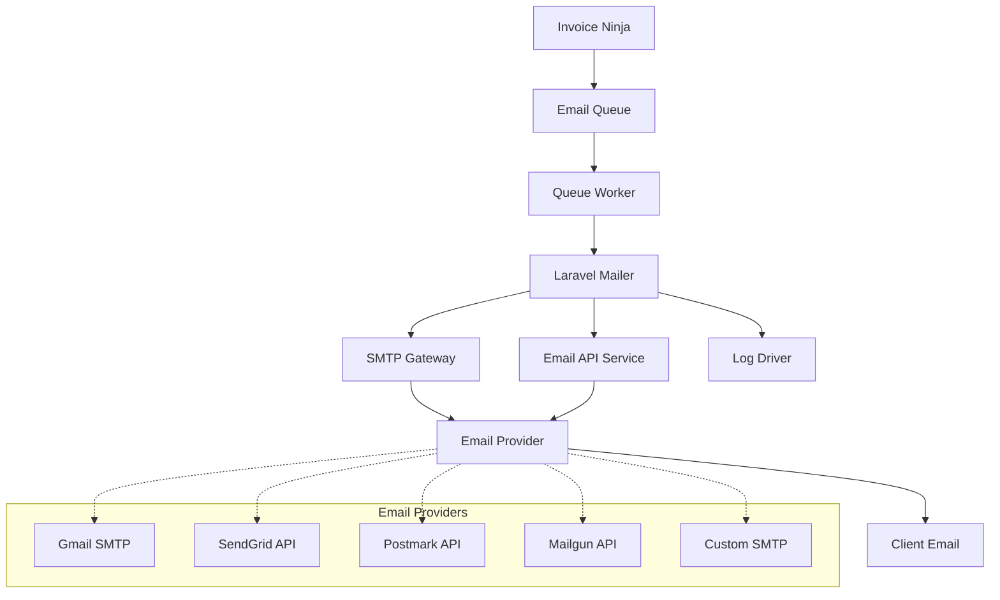

**Purpose:** Configure email delivery for Invoice Ninja invoice sending, notifications, and system communications.

**Contents**
- [Email Overview](#email-overview)
- [SMTP Configuration](#smtp-configuration)
- [Email Types and Templates](#email-types-and-templates)
- [Queue-Based Email Processing](#queue-based-email-processing)
- [Email Security and Compliance](#email-security-and-compliance)
- [Monitoring and Troubleshooting](#monitoring-and-troubleshooting)
- [Sources](#sources)

## Email Overview

### Email Functionality in Invoice Ninja
Invoice Ninja relies heavily on email for business operations:

- **Invoice Delivery**: Send invoices, estimates, and statements to clients
- **Payment Notifications**: Notify clients of successful payments and receipts
- **System Notifications**: User account management, password resets, system alerts
- **Marketing Communications**: Newsletter functionality and client engagement
- **Administrative Alerts**: Error notifications, system status updates

### Email Architecture


### Supported Email Methods
| Method | Use Case | Configuration | Performance |
|--------|----------|---------------|-------------|
| **SMTP** | Traditional email servers | Host, port, credentials | Good for low volume |
| **Mailgun** | High-volume transactional | API key, domain | Excellent for scale |
| **Postmark** | Transactional focus | API token | Fast delivery |
| **SendGrid** | Marketing + transactional | API key | Good analytics |
| **Log** | Development/testing | File-based logging | Development only |

## SMTP Configuration

### Environment Variables
Email configuration is managed through environment variables:

| Variable | Development | Production | Purpose |
|----------|-------------|------------|---------|
| `MAIL_MAILER` | `log` | `smtp` or `postmark` | Email delivery method |
| `MAIL_HOST` | `mailhog` | `smtp.gmail.com` | SMTP server hostname |
| `MAIL_PORT` | `1025` | `587` | SMTP server port |
| `MAIL_USERNAME` | `""` | `invoices@company.com` | SMTP authentication username |
| `MAIL_PASSWORD` | `""` | `app_specific_password` | SMTP authentication password |
| `MAIL_ENCRYPTION` | `""` | `tls` | Encryption method (tls, ssl) |
| `MAIL_FROM_ADDRESS` | `ryan@webgrip.nl` | `invoices@company.com` | Default sender address |
| `MAIL_FROM_NAME` | `"Invoice Ninja"` | `"Company Invoices"` | Default sender name |

### Laravel Mail Configuration
Laravel mail configuration structure:

```php
// config/mail.php
'default' => env('MAIL_MAILER', 'log'),

'mailers' => [
    'smtp' => [
        'transport' => 'smtp',
        'host' => env('MAIL_HOST', 'smtp.mailgun.org'),
        'port' => env('MAIL_PORT', 587),
        'encryption' => env('MAIL_ENCRYPTION', 'tls'),
        'username' => env('MAIL_USERNAME'),
        'password' => env('MAIL_PASSWORD'),
        'timeout' => null,
        'local_domain' => env('MAIL_EHLO_DOMAIN'),
    ],

    'postmark' => [
        'transport' => 'postmark',
        'message_stream_id' => env('POSTMARK_MESSAGE_STREAM_ID'),
        'client' => [
            'timeout' => 5,
        ],
    ],

    'mailgun' => [
        'transport' => 'mailgun',
        'client' => [
            'timeout' => 5,
        ],
    ],
],

'from' => [
    'address' => env('MAIL_FROM_ADDRESS', 'hello@example.com'),
    'name' => env('MAIL_FROM_NAME', 'Example'),
],
```

### Common SMTP Providers
Production-ready SMTP configurations:

#### Gmail/Google Workspace
```bash
MAIL_MAILER=smtp
MAIL_HOST=smtp.gmail.com
MAIL_PORT=587
MAIL_USERNAME=invoices@company.com
MAIL_PASSWORD=app_specific_password  # Use App Password, not account password
MAIL_ENCRYPTION=tls
MAIL_FROM_ADDRESS=invoices@company.com
MAIL_FROM_NAME="Company Invoices"
```

#### Microsoft 365/Outlook
```bash
MAIL_MAILER=smtp
MAIL_HOST=smtp-mail.outlook.com
MAIL_PORT=587
MAIL_USERNAME=invoices@company.com
MAIL_PASSWORD=account_password
MAIL_ENCRYPTION=starttls
MAIL_FROM_ADDRESS=invoices@company.com
MAIL_FROM_NAME="Company Invoices"
```

#### SendGrid SMTP
```bash
MAIL_MAILER=smtp
MAIL_HOST=smtp.sendgrid.net
MAIL_PORT=587
MAIL_USERNAME=apikey
MAIL_PASSWORD=your_sendgrid_api_key
MAIL_ENCRYPTION=tls
MAIL_FROM_ADDRESS=invoices@company.com
MAIL_FROM_NAME="Company Invoices"
```

### Postmark API Configuration
For high-volume transactional emails:

```bash
MAIL_MAILER=postmark
POSTMARK_SECRET=your_postmark_server_api_token
MAIL_FROM_ADDRESS=invoices@company.com
MAIL_FROM_NAME="Company Invoices"
```

## Email Types and Templates

### Invoice Ninja Email Types
Invoice Ninja sends various types of emails:

| Email Type | Template | Trigger | Frequency |
|------------|----------|---------|-----------|
| **Invoice Email** | `invoice` | Manual send or auto-send | Per invoice |
| **Quote Email** | `quote` | Quote creation/approval | Per quote |
| **Payment Email** | `payment` | Payment received | Per payment |
| **Reminder Email** | `reminder` | Overdue invoices | Scheduled |
| **Statement Email** | `statement` | Monthly statements | Monthly |
| **Welcome Email** | `welcome` | New user registration | Once per user |
| **Password Reset** | `password_reset` | Password reset request | As needed |

### Email Template Structure
Invoice Ninja uses Laravel Blade templates for emails:

```php
// Email template example (simplified)
@extends('email.template')

@section('header')
    Invoice from {{ $company->present()->name }}
@endsection

@section('content')
    <h2>Invoice {{ $invoice->number }}</h2>
    
    <p>Dear {{ $invoice->client->present()->name }},</p>
    
    <p>Please find your invoice attached. The total amount due is 
       {{ $invoice->present()->amount() }}.</p>
    
    <table>
        @foreach($invoice->line_items as $item)
            <tr>
                <td>{{ $item->notes }}</td>
                <td>{{ $item->present()->quantity() }}</td>
                <td>{{ $item->present()->cost() }}</td>
            </tr>
        @endforeach
    </table>
    
    <p>Payment is due by {{ $invoice->present()->due_date() }}.</p>
@endsection

@section('footer')
    Thank you for your business!
@endsection
```

### Email Customization
Companies can customize email templates:

- **Custom Branding**: Logo, colors, fonts
- **Custom Text**: Personalized messages and terms
- **Custom Fields**: Include custom invoice fields
- **Multi-language**: Localized templates based on client language
- **PDF Attachments**: Automatic PDF generation and attachment

### Email Scheduling
Invoice Ninja supports scheduled email sending:

```php
// Recurring invoice email scheduling
$recurringInvoice->auto_bill_enabled = true;
$recurringInvoice->auto_bill_date = 'on_send_date';

// Reminder emails for overdue invoices
$company->settings->enable_reminder1 = true;
$company->settings->schedule_reminder1 = '7'; // 7 days after due date
$company->settings->late_fee_amount1 = 25.00;

// Statement generation and sending
$company->settings->send_statement_emails = true;
$company->settings->statement_email_frequency = 'monthly';
```

## Queue-Based Email Processing

### Email Queue Configuration
Emails are processed through Laravel's queue system:

```php
// config/queue.php
'connections' => [
    'redis' => [
        'driver' => 'redis',
        'connection' => 'default',
        'queue' => env('REDIS_QUEUE', 'default'),
        'retry_after' => 90,
        'block_for' => null,
        'after_commit' => false,
    ],
],
```

### Email Job Processing
Email jobs are queued for background processing:

```php
// Email job example
class SendInvoiceEmail implements ShouldQueue
{
    use Dispatchable, InteractsWithQueue, Queueable, SerializesModels;

    public function __construct(
        public Invoice $invoice,
        public Company $company,
        public ?string $template = 'invoice'
    ) {}

    public function handle()
    {
        try {
            Mail::to($this->invoice->client->primary_contact)
                ->send(new InvoiceMail($this->invoice, $this->company, $this->template));
            
            // Log successful send
            $this->invoice->markEmailSent();
            
        } catch (Exception $e) {
            // Handle failure
            Log::error('Email send failed', [
                'invoice_id' => $this->invoice->id,
                'error' => $e->getMessage()
            ]);
            
            throw $e; // Re-throw for queue retry
        }
    }
}
```

### Queue Management
```bash
# Start email queue worker
php artisan queue:work redis --queue=emails --tries=3 --timeout=60

# Monitor email queue
php artisan queue:stats

# Process single email job
php artisan queue:work redis --queue=emails --once

# Handle failed email jobs
php artisan queue:failed          # List failed jobs
php artisan queue:retry all       # Retry all failed emails
php artisan queue:flush           # Clear failed job queue
```

### Bulk Email Processing
For large volumes, implement batch processing:

```php
// Batch invoice email sending
$invoices = Invoice::where('status_id', Invoice::STATUS_SENT)
    ->where('needs_email', true)
    ->chunk(100, function ($invoices) {
        foreach ($invoices as $invoice) {
            SendInvoiceEmail::dispatch($invoice, $invoice->company)
                ->onQueue('emails')
                ->delay(now()->addSeconds(rand(1, 30))); // Spread load
        }
    });
```

## Email Security and Compliance

### Authentication and Security
Email security best practices:

- **SPF Records**: Authorize sending servers in DNS
- **DKIM Signing**: Cryptographic signing of emails
- **DMARC Policy**: Email authentication and reporting
- **TLS Encryption**: Encrypted email transmission
- **API Authentication**: Secure API keys for service providers

### SPF/DKIM/DMARC Setup
DNS records for email authentication:

```dns
; SPF record - authorize sending servers
company.com. IN TXT "v=spf1 include:_spf.google.com include:sendgrid.net ~all"

; DKIM record - digital signature
default._domainkey.company.com. IN TXT "v=DKIM1; k=rsa; p=public_key_here"

; DMARC policy - authentication reporting
_dmarc.company.com. IN TXT "v=DMARC1; p=quarantine; rua=mailto:dmarc@company.com"
```

### Privacy and Compliance
- **GDPR Compliance**: Respect email preferences and unsubscribe requests
- **CAN-SPAM**: Include physical address and unsubscribe links
- **Data Retention**: Limit email log retention according to policy
- **Consent Management**: Track email consent and preferences

### Email Rate Limiting
Prevent spam classification through rate limiting:

```php
// Rate limiting configuration
'throttle' => [
    'emails' => [
        'max_attempts' => 100,    // Max emails per period
        'decay_minutes' => 60,    // Reset period
    ],
],

// Implement in email sending
if (RateLimiter::tooManyAttempts('emails:' . $company->id, 100)) {
    throw new TooManyEmailsException('Rate limit exceeded');
}

RateLimiter::hit('emails:' . $company->id, 3600); // 1 hour decay
```

## Monitoring and Troubleshooting

### Email Monitoring Metrics
Key metrics to track for email system health:

| Metric | Target | Alert Threshold | Purpose |
|--------|--------|-----------------|---------|
| **Email Queue Length** | < 100 pending | > 500 pending | Processing capacity |
| **Send Success Rate** | > 95% | < 90% | Delivery reliability |
| **Average Send Time** | < 30 seconds | > 60 seconds | Performance monitoring |
| **Bounce Rate** | < 5% | > 10% | Email quality |
| **Failed Job Rate** | < 2% | > 5% | System reliability |

### Email Logging
Comprehensive email logging for troubleshooting:

```php
// Enhanced email logging
Log::channel('email')->info('Email queued', [
    'type' => 'invoice',
    'invoice_id' => $invoice->id,
    'recipient' => $invoice->client->primary_contact->email,
    'company_id' => $company->id,
    'queue' => 'emails'
]);

Log::channel('email')->info('Email sent successfully', [
    'invoice_id' => $invoice->id,
    'message_id' => $messageId,
    'send_time' => $sendTime,
    'provider' => 'postmark'
]);
```

### Common Issues and Solutions

| Problem | Symptom | Solution |
|---------|---------|----------|
| **SMTP Authentication Failure** | 535 Authentication failed | Verify credentials, use app passwords |
| **High Bounce Rate** | Emails not reaching recipients | Validate email addresses, check DNS records |
| **Emails in Spam** | Low open rates | Implement SPF/DKIM/DMARC, warm up IP |
| **Queue Backlog** | Delayed email delivery | Scale queue workers, optimize send rate |
| **API Rate Limits** | 429 Too Many Requests | Implement rate limiting, use multiple providers |

### Diagnostic Commands
```bash
# Test email configuration
make run CMD="php artisan tinker --execute='
  use Illuminate\Support\Facades\Mail;
  Mail::raw(\"Test email\", function(\$msg) {
    \$msg->to(\"test@example.com\")->subject(\"Test\");
  });
  echo \"Email sent\";
'"

# Check email queue status
make run CMD="php artisan queue:stats"

# View email logs
make logs SERVICE=firefly-iii-application.application | grep -i email

# Test SMTP connectivity
telnet smtp.gmail.com 587

# Check DNS records
dig TXT company.com | grep spf
dig TXT default._domainkey.company.com
dig TXT _dmarc.company.com
```

### Email Testing Tools
Development and testing utilities:

```bash
# MailHog for development (already configured)
# Access web interface at http://localhost:8025

# Test email deliverability
# Use mail-tester.com or similar services

# Monitor email reputation
# Check sender score and reputation services
```

## Container Interface

| Aspect | Value / Path | Notes |
|-------|---------------|-------|
| Development Mail | MailHog on port 1025 | Web interface on 8025 |
| Production Mail | SMTP/API providers | Configured via environment |
| Email Queue | Redis-backed Laravel queue | Background job processing |
| Email Logs | Laravel logs + STDOUT | Centralized log collection |
| Templates | Blade templates in resources/views/email | Customizable branding |
| Attachments | PDF generation + attachment | Automatic invoice PDFs |

## Sources

- "Laravel Mail Documentation" — https://laravel.com/docs/10.x/mail — retrieved 2025-01-09
- "Invoice Ninja Email Configuration" — https://invoiceninja.github.io/en/self-host-installation/#mail — retrieved 2025-01-09
- "Postmark Documentation" — https://postmarkapp.com/developer — retrieved 2025-01-09
- "SendGrid SMTP Documentation" — https://docs.sendgrid.com/for-developers/sending-email/integrating-with-the-smtp-api — retrieved 2025-01-09
- "Email Authentication Best Practices" — https://dmarc.org/overview/ — retrieved 2025-01-09