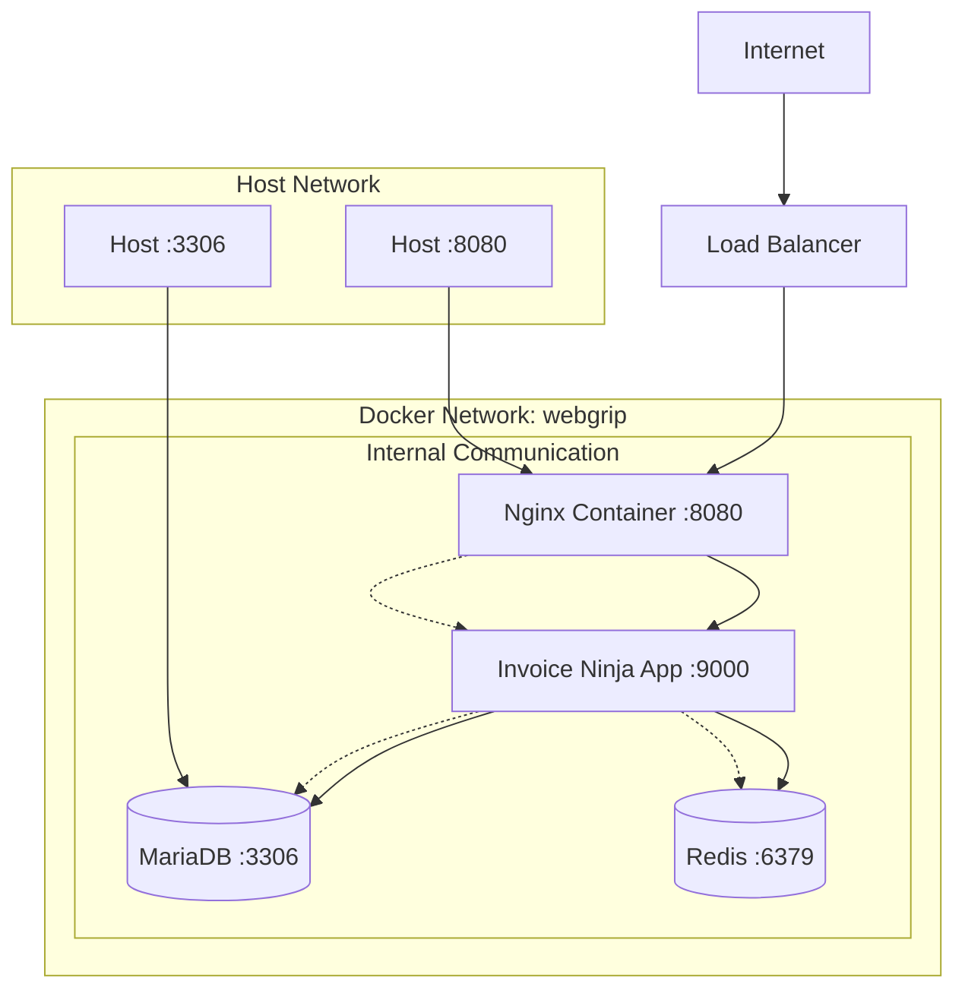

**Purpose:** Understand network configuration, port mapping, proxy setup, and SSL termination for Invoice Ninja deployment.

**Contents**
- [Network Architecture](#network-architecture)
- [Port Configuration](#port-configuration)
- [SSL/TLS Configuration](#ssltls-configuration)
- [Proxy Configuration](#proxy-configuration)
- [Network Security](#network-security)
- [Load Balancing](#load-balancing)
- [Troubleshooting](#troubleshooting)
- [Sources](#sources)

## Network Architecture

### Container Network Topology
Invoice Ninja uses a custom Docker bridge network for service communication:



### Network Segmentation
Network isolation and security boundaries:

| Network Layer | Components | Access Level | Security |
|---------------|------------|--------------|----------|
| **Public** | Load Balancer, CDN | Internet accessible | SSL termination, DDoS protection |
| **DMZ** | Nginx reverse proxy | Internal + limited external | Rate limiting, WAF |
| **Application** | Invoice Ninja containers | Internal only | Service mesh, mTLS |
| **Data** | Database, cache | Application tier only | Network policies, encryption |

### Service Discovery
Container name resolution within the Docker network:

```bash
# Internal service hostnames
firefly-iii-application.nginx          # Web server
firefly-iii-application.application    # Application server
firefly-iii-application.mariadb        # Database server
firefly-iii-application.redis          # Cache server

# Kubernetes service names (production)
firefly-iii-application-redis-master   # Redis master
firefly-iii-application-mariadb        # MariaDB service
```

## Port Configuration

### Container Port Mapping
Port allocation and mapping strategy:

| Service | Container Port | Host Port | Protocol | Purpose |
|---------|----------------|-----------|----------|---------|
| **Nginx** | 80 | 8080 | HTTP | Web server (primary access) |
| **Application** | 9000 | 9000 | FastCGI | PHP-FPM backend |
| **MariaDB** | 3306 | 3306 | TCP | Database access (development) |
| **Redis** | 6379 | - | TCP | Cache (internal only) |

### Docker Compose Port Configuration
```yaml
services:
  firefly-iii-application.nginx:
    ports:
      - "127.0.0.1:8080:80"    # Bind to localhost only
    
  firefly-iii-application.application:
    ports:
      - "127.0.0.1:9000:9000"  # Development debugging only
    
  firefly-iii-application.mariadb:
    ports:
      - "127.0.0.1:3306:3306"  # Database administration
    
  firefly-iii-application.redis:
    # No exposed ports - internal only
```

### Kubernetes Port Configuration
```yaml
# Service port mapping in Kubernetes
service:
  main:
    controller: main
    ports:
      http:
        port: 80           # External service port
        targetPort: 8080   # Container port (nginx)
        
# Ingress configuration
ingress:
  main:
    hosts:
      - host: firefly-iii-application.staging.k8s.webgrip.nl
        paths:
          - path: /
            service:
              identifier: main
              port: http   # References service port above
```

### Port Security
Security considerations for port exposure:

- **Localhost Binding**: Development ports bound to `127.0.0.1` only
- **No Direct Database Access**: Production database not exposed externally
- **Internal Communication**: Redis and internal services use container network
- **Firewall Rules**: Host firewall restricts external access to necessary ports

## SSL/TLS Configuration

### Development SSL
Local development SSL setup:

```bash
# Generate self-signed certificate for development
openssl req -x509 -nodes -days 365 -newkey rsa:2048 \
  -keyout localhost.key -out localhost.crt \
  -subj "/C=NL/ST=Amsterdam/L=Amsterdam/O=WebGrip/CN=localhost"

# Nginx SSL configuration (development)
server {
    listen 443 ssl;
    server_name localhost;
    
    ssl_certificate /etc/nginx/ssl/localhost.crt;
    ssl_certificate_key /etc/nginx/ssl/localhost.key;
    ssl_protocols TLSv1.2 TLSv1.3;
    ssl_ciphers ECDHE-RSA-AES256-GCM-SHA512:DHE-RSA-AES256-GCM-SHA512;
    
    location / {
        proxy_pass http://firefly-iii-application.application:9000;
        proxy_set_header Host $host;
        proxy_set_header X-Real-IP $remote_addr;
        proxy_set_header X-Forwarded-For $proxy_add_x_forwarded_for;
        proxy_set_header X-Forwarded-Proto $scheme;
    }
}
```

### Production SSL with Let's Encrypt
Automated SSL certificate management:

```yaml
# Kubernetes Ingress with cert-manager
ingress:
  main:
    enabled: true
    className: ingress-traefik
    annotations:
      cert-manager.io/cluster-issuer: letsencrypt-traefik
      traefik.ingress.kubernetes.io/router.middlewares: ingress-traefik-ryan-home-ip-allow-list@kubernetescrd
    hosts:
      - host: firefly-iii-application.staging.k8s.webgrip.nl
        paths:
          - path: /
            service:
              identifier: main
              port: http
    tls:
      - secretName: letsencrypt-firefly-iii-application
        hosts:
          - firefly-iii-application.staging.k8s.webgrip.nl
```

### SSL Security Headers
Enhanced security headers for HTTPS:

```nginx
# Security headers in Nginx configuration
add_header Strict-Transport-Security "max-age=31536000; includeSubDomains" always;
add_header X-Content-Type-Options "nosniff" always;
add_header X-Frame-Options "SAMEORIGIN" always;
add_header X-XSS-Protection "1; mode=block" always;
add_header Referrer-Policy "strict-origin-when-cross-origin" always;
add_header Content-Security-Policy "default-src 'self'; script-src 'self' 'unsafe-inline'; style-src 'self' 'unsafe-inline'" always;
```

## Proxy Configuration

### Nginx Reverse Proxy
Nginx configuration for PHP-FPM backend:

```nginx
# /etc/nginx/conf.d/default.conf
map $http_x_forwarded_proto $fastcgi_https { 
    default off; 
    https on; 
}

gzip on;
gzip_types application/javascript text/javascript application/json text/css text/plain application/xml;
gzip_proxied any;
gzip_min_length 1024;

server {
    listen 8080;
    root /var/www/app/public;
    index index.php index.html;

    # Health check endpoint
    location = /health { 
        return 200 'ok'; 
        add_header Content-Type text/plain; 
    }

    # Static asset caching
    location ~* \.(?:css|js|mjs|map|png|jpg|jpeg|gif|ico|svg|json|webmanifest|woff|woff2|ttf|eot)$ {
        try_files $uri =404;
        access_log off;
        expires 1y;
        add_header Cache-Control "public, immutable";
    }

    # Storage files
    location ^~ /storage/ {
        alias /var/www/app/storage/app/public/;
        try_files $uri =404;
    }

    # Application routing
    location / {
        try_files $uri $uri/ /index.php?$query_string;
    }

    # PHP processing
    location = /index.php {
        include fastcgi_params;
        fastcgi_pass 127.0.0.1:9000;
        fastcgi_param SCRIPT_FILENAME $document_root$fastcgi_script_name;
        fastcgi_param HTTP_HOST $host;
        fastcgi_param SERVER_NAME $host;
        fastcgi_param SERVER_PORT $server_port;
        fastcgi_param HTTPS $fastcgi_https;
        fastcgi_param HTTP_X_FORWARDED_PROTO $http_x_forwarded_proto;
        fastcgi_param HTTP_X_FORWARDED_HOST $http_x_forwarded_host;
        fastcgi_param HTTP_X_FORWARDED_FOR $proxy_add_x_forwarded_for;
        fastcgi_read_timeout 600;
        fastcgi_send_timeout 600;
        fastcgi_connect_timeout 60;
    }

    # Block direct PHP access
    location ~ \.php$ { 
        return 403; 
    }
}
```

### Proxy Headers
Essential headers for proper Laravel operation behind proxy:

| Header | Purpose | Laravel Usage |
|--------|---------|---------------|
| `X-Forwarded-Proto` | Protocol (HTTP/HTTPS) | SSL detection, URL generation |
| `X-Forwarded-Host` | Original hostname | Proper domain in emails/links |
| `X-Forwarded-For` | Client IP address | Logging, rate limiting, security |
| `X-Real-IP` | Original client IP | User tracking, geolocation |
| `Host` | Target hostname | Virtual host routing |

### Trusted Proxies Configuration
Laravel trusted proxy configuration:

```php
// In Invoice Ninja environment
TRUSTED_PROXIES=**              # Trust all proxies (behind load balancer)

// Laravel configuration
'proxies' => env('TRUSTED_PROXIES', ''),
'headers' => Request::HEADER_X_FORWARDED_ALL,
```

## Network Security

### Access Control
Network-level access restrictions:

```yaml
# Kubernetes NetworkPolicy example
apiVersion: networking.k8s.io/v1
kind: NetworkPolicy
metadata:
  name: invoice-ninja-network-policy
spec:
  podSelector:
    matchLabels:
      app: firefly-iii-application
  policyTypes:
  - Ingress
  - Egress
  ingress:
  - from:
    - podSelector:
        matchLabels:
          app: nginx-ingress
    ports:
    - protocol: TCP
      port: 8080
  egress:
  - to:
    - podSelector:
        matchLabels:
          app: mariadb
    ports:
    - protocol: TCP
      port: 3306
  - to:
    - podSelector:
        matchLabels:
          app: redis
    ports:
    - protocol: TCP
      port: 6379
```

### Rate Limiting
Network-level rate limiting configuration:

```nginx
# Nginx rate limiting
http {
    limit_req_zone $binary_remote_addr zone=login:10m rate=5r/m;
    limit_req_zone $binary_remote_addr zone=api:10m rate=100r/m;
    limit_req_zone $binary_remote_addr zone=general:10m rate=20r/m;
    
    server {
        # Login protection
        location ~ ^/login {
            limit_req zone=login burst=3 nodelay;
            # ... other config
        }
        
        # API protection
        location ~ ^/api/ {
            limit_req zone=api burst=20 nodelay;
            # ... other config
        }
        
        # General rate limiting
        location / {
            limit_req zone=general burst=10 nodelay;
            # ... other config
        }
    }
}
```

### Firewall Configuration
Host-level firewall rules:

```bash
# UFW firewall rules (Ubuntu)
ufw default deny incoming
ufw default allow outgoing

# Allow SSH
ufw allow 22/tcp

# Allow HTTP/HTTPS
ufw allow 80/tcp
ufw allow 443/tcp

# Allow specific application access (development)
ufw allow from 192.168.0.0/16 to any port 8080
ufw allow from 10.0.0.0/8 to any port 8080

# Block direct database access from external
ufw deny 3306/tcp
ufw deny 6379/tcp

ufw enable
```

## Load Balancing

### External Load Balancer
Production load balancer configuration:

```yaml
# Traefik load balancer configuration
http:
  services:
    invoice-ninja-service:
      loadBalancer:
        servers:
          - url: "http://10.0.1.10:8080"
          - url: "http://10.0.1.11:8080"
        healthCheck:
          path: "/health"
          interval: "30s"
          timeout: "5s"
        
  routers:
    invoice-ninja-router:
      rule: "Host(`invoices.company.com`)"
      service: invoice-ninja-service
      tls:
        certResolver: letsencrypt
      middlewares:
        - rate-limit
        - security-headers

  middlewares:
    rate-limit:
      rateLimit:
        burst: 100
        average: 50
        
    security-headers:
      headers:
        customRequestHeaders:
          X-Forwarded-Proto: "https"
        customResponseHeaders:
          X-Frame-Options: "SAMEORIGIN"
          X-Content-Type-Options: "nosniff"
```

### Session Affinity
For applications requiring session persistence:

```nginx
# Nginx upstream with session affinity
upstream invoice_ninja_backend {
    ip_hash;  # Session affinity based on client IP
    server 10.0.1.10:8080 max_fails=3 fail_timeout=30s;
    server 10.0.1.11:8080 max_fails=3 fail_timeout=30s;
    server 10.0.1.12:8080 backup;  # Backup server
}

server {
    location / {
        proxy_pass http://invoice_ninja_backend;
        proxy_set_header Host $host;
        proxy_set_header X-Real-IP $remote_addr;
        proxy_set_header X-Forwarded-For $proxy_add_x_forwarded_for;
        proxy_set_header X-Forwarded-Proto $scheme;
        
        # Connection pooling
        proxy_http_version 1.1;
        proxy_set_header Connection "";
        
        # Timeouts
        proxy_connect_timeout 60s;
        proxy_send_timeout 60s;
        proxy_read_timeout 60s;
    }
}
```

## Troubleshooting

### Network Connectivity Testing
Diagnostic commands for network issues:

```bash
# Test external connectivity
curl -I http://localhost:8080
curl -I https://firefly-iii-application.staging.k8s.webgrip.nl

# Test internal service connectivity
docker exec firefly-iii-application.nginx curl -I http://firefly-iii-application.application:9000
docker exec firefly-iii-application.application nc -zv firefly-iii-application.mariadb 3306
docker exec firefly-iii-application.application nc -zv firefly-iii-application.redis 6379

# Check port listeners
netstat -tlnp | grep -E "(8080|3306|6379|9000)"
ss -tlnp | grep -E "(8080|3306|6379|9000)"

# DNS resolution testing
nslookup firefly-iii-application.staging.k8s.webgrip.nl
dig firefly-iii-application.staging.k8s.webgrip.nl

# SSL certificate testing
openssl s_client -connect firefly-iii-application.staging.k8s.webgrip.nl:443 -servername firefly-iii-application.staging.k8s.webgrip.nl
```

### Common Network Issues

| Problem | Symptom | Solution |
|---------|---------|----------|
| **Connection Refused** | Cannot reach application | Check port mapping, firewall rules |
| **SSL Certificate Error** | Browser security warning | Verify certificate validity, DNS configuration |
| **502 Bad Gateway** | Nginx cannot reach backend | Check PHP-FPM process, container connectivity |
| **Slow Response** | High latency | Check network bandwidth, proxy timeouts |
| **Session Issues** | Users logged out frequently | Verify session persistence, load balancer affinity |

### Network Monitoring
Monitor network performance and connectivity:

```bash
# Monitor network connections
watch -n 1 'netstat -an | grep -E "(8080|3306|6379)" | wc -l'

# Check connection pool usage
docker exec firefly-iii-application.nginx nginx -T | grep worker_connections

# Monitor network traffic
iftop -i docker0
tcpdump -i docker0 port 8080

# SSL certificate monitoring
echo | openssl s_client -connect firefly-iii-application.staging.k8s.webgrip.nl:443 2>/dev/null | openssl x509 -noout -dates
```

## Container Interface

| Aspect | Value / Path | Notes |
|-------|---------------|-------|
| **Network Name** | `webgrip` | Custom Docker bridge network |
| **Primary Access** | Port 8080 | Nginx reverse proxy |
| **Internal Communication** | Container hostnames | Service discovery via DNS |
| **SSL Termination** | Load balancer or Ingress | TLS 1.2+ with modern ciphers |
| **Health Checks** | `/health` endpoint | Nginx returns 200 OK |
| **Rate Limiting** | Nginx/Traefik middleware | Configurable per endpoint |

## Sources

- "Nginx Configuration Guide" — https://nginx.org/en/docs/beginners_guide.html — retrieved 2025-01-09
- "Docker Networking" — https://docs.docker.com/network/ — retrieved 2025-01-09
- "Kubernetes Networking" — https://kubernetes.io/docs/concepts/services-networking/ — retrieved 2025-01-09
- "Traefik Load Balancer" — https://doc.traefik.io/traefik/ — retrieved 2025-01-09
- "Let's Encrypt SSL Automation" — https://letsencrypt.org/docs/ — retrieved 2025-01-09